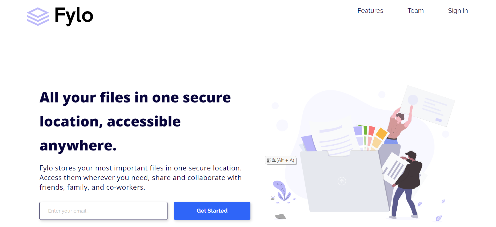
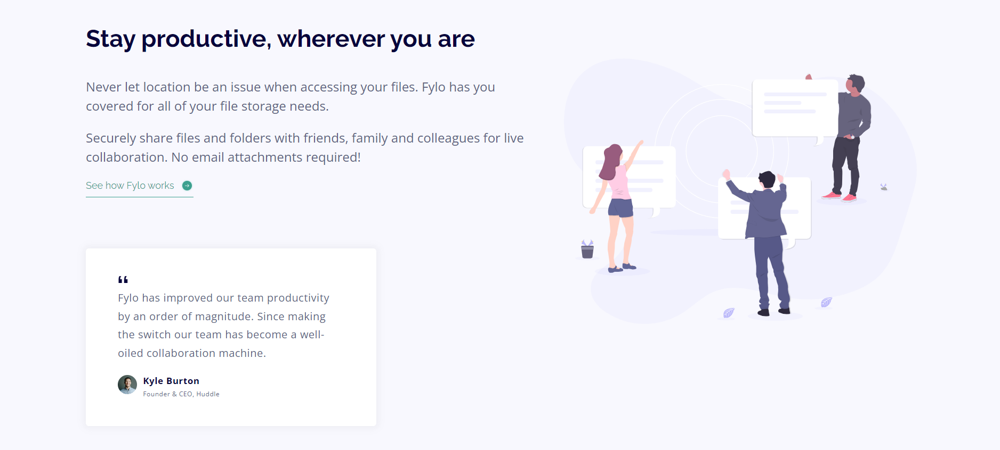
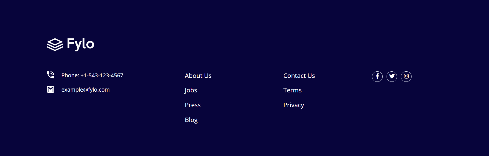

# Frontend Mentor - Fylo landing page with two column layout solution

## Table of contents

- [Overview](#overview)
  - [The challenge](#the-challenge)
  - [Screenshot](#screenshot)
  - [Links](#links)
  - [Built with](#built-with)
  - [What I learned](#what-i-learned)
  - [Continued development](#continued-development)
  - [Useful resources](#useful-resources)
- [Acknowledgments](#acknowledgments)

## Overview

This is a solution to the [Fylo landing page with two column layout challenge on Frontend Mentor](https://www.frontendmentor.io/challenges/fylo-landing-page-with-two-column-layout-5ca5ef041e82137ec91a50f5).

### The challenge

The challenge was to build a responsive page from a figma design (https://www.figma.com/file/Wwx6Vxs5539DW0xpB8mOZ2/fylo-landing-page-with-two-column-layout?node-id=0%3A122&t=G7WKQXvV9VIy5obE-0) with different hover states for interactive elements and with a little bit of JavaScript for validating an email address.

### Screenshot

### Links

- Solution URL: [Solution URL here](https://github.com/NunuAbuashvili/Fylo-Landing-Page.git)
- Live Site URL: [Live site URL here](https://nunuabuashvili.github.io/Fylo-Landing-Page/)

### Built with

- Semantic HTML5 markup
- CSS custom properties
- Flexbox
- CSS Grid
- Mobile-first workflow
- JavaScript

### What I learned

I learnt two different ways of executing click events in JavaScript: first, the "onclick" style right from the HTML page, second the click "eventListner" from JavaScript file.

### Continued development

I want to focus more on JavaScript in future projects and make the pages that I build more interactive.

### Useful resources

- [HTML Button onclick - JavaScript Click Event Tutorial](https://www.freecodecamp.org/news/html-button-onclick-javascript-click-event-tutorial/) - This helped me understand the ways of executing click events in JavaScript.
- [How to Do an Email Validation in JavaScript?](https://www.simplilearn.com/tutorials/javascript-tutorial/email-validation-in-javascript) - I used this article in order to see how email validation works in JavaScript.

## Acknowledgments

I would like to thank my mentor Paata Gharibashvili for helping me overcome the challenges that I have faced while working through this project.
